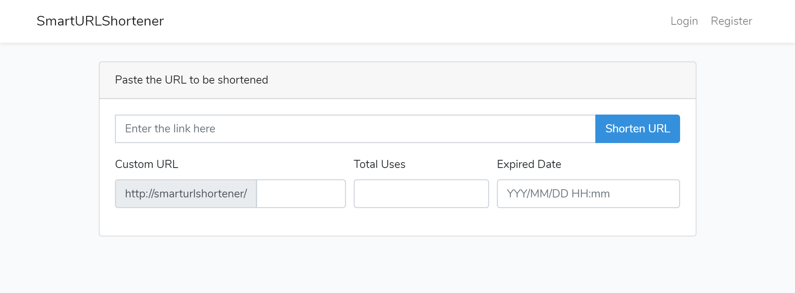

## SmartURLShortener

Smart URL shortening tools in Laravel

## Screenshot

### Features
* URL Shortener.
* Customized short URLs.
* Expire date for shorten URLs.
* Click limitation for short's URLs.
* User's dashboard.
* Short's URL statistics.
* Written in [PHP](https://www.php.net/) and [Laravel 7](https://laravel.com/docs/7.x).

## Requirements
* PHP >= 7.2.5
* [Composer](https://getcomposer.org)
* A supported database: MySQL or MariaDB.

## Quick Start

### Installation Instructions
1. Run `composer install`.

2. Rename `.env.example` file to `.env`. Update `.env` to your specific needs.

3. Run `php artisan key:generate`.

4. Run `php artisan migrate`.

5. Run `php artisan serve`.

   After installation, you can access `http://localhost:8000` on your browser.

### Running Tests

Run `php artisan test`.
 

## License

The SmartURLShortener is open-sourced software licensed under the [MIT license](https://opensource.org/licenses/MIT).
